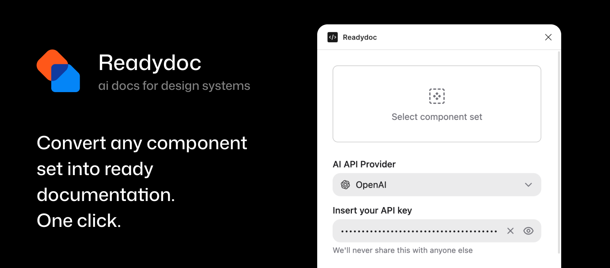

# Readydoc

Readydoc is a Figma plugin that automatically generates component documentation frames. Select a Component Set, choose an AI provider, and the plugin builds a structured frame with variant descriptions and live component instances placed directly next to your component on the canvas.

## Install

1. Download this repo as a ZIP (green **Code** button, then **Download ZIP**)
2. Unzip it anywhere on your computer
3. Open **Figma Desktop**
4. Go to **Plugins > Development > Import plugin from manifest...**
5. Select `plugin/manifest.json` from the unzipped folder

To update: download the ZIP again and replace the old folder.

## How to use

1. Select a Component Set on the canvas
2. Open the plugin — it reads the selected component automatically
3. Pick an AI provider and paste your API key
4. Choose a language for descriptions (English or Russian)
5. Optionally add context about the component or its product area
6. Choose which manual sections to include in the output
7. Click **Generate**

The plugin creates a `<ComponentName> / Readme` frame next to your component.

## What gets generated

Each documentation frame includes:

- **Title block** — component name and an AI-generated one-line description
- **Variant sections** — one section per variant property, with a live component instance for each value
- **Boolean sections** — sections for boolean and boolean-like variant properties
- **Manual sections** — empty placeholder sections (Usage, Mechanics, Edge Cases, Accessibility) for you to fill in
- **Footer** — "Created with love by Readydoc"

## AI providers

| Provider | Model | Get a key |
|---|---|---|
| Grok | grok-3-mini | [console.x.ai](https://console.x.ai) |
| Claude | claude-haiku-4-5 | [console.anthropic.com](https://console.anthropic.com) |
| OpenAI | gpt-4.1-mini | [platform.openai.com](https://platform.openai.com) |
| Gemini | gemini-2.0-flash-lite | [aistudio.google.com](https://aistudio.google.com) |
| DeepSeek | deepseek-chat | [platform.deepseek.com](https://platform.deepseek.com) |

API keys are stored locally in Figma's client storage. Nothing is shared outside of the AI provider you select.

## Requirements

- Figma Desktop (the plugin runs in development mode from a local manifest)
- A Component Set with at least one Variant or Boolean property
- An API key for any supported AI provider
